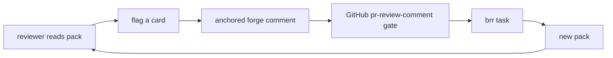

# Design: diffense — kb-first PR review experience

Status: accepted on 2026-05-29. The card / zoom / navigation model is
validated by a working renderer spike
([`src/brr/diffense/`](../src/brr/diffense)) rendered against the
hand-authored [PR #64 pack](diffense-prototype-pr64.md). The implemented
surface today is only that spike plus the prototype pack; pack generation,
schema lock, `brr review`, validation, transport, and flag actions still
belong to an implementation plan.

diffense is brr's review surface for agent-generated PRs. It exists
because a typical brr PR is not just code: much of its value is in the
kb graph, lifecycle markers, subject hubs, design pages, and commit
reasoning that generic forge diffs flatten into raw hunks. diffense turns
the change into a structured **review pack** and renders that pack as a
zoomable graph of inspection cards.

Current evidence:

- [`diffense-prototype-pr64.md`](diffense-prototype-pr64.md) pressure-tests
  the card schema against a real braided PR.
- [`diffense-prototype-pr64-pack.json`](diffense-prototype-pr64-pack.json)
  is the concrete prototype pack.
- [`src/brr/diffense/template.html`](../src/brr/diffense/template.html)
  and [`src/brr/diffense/render.py`](../src/brr/diffense/render.py) render
  that pack into a dependency-free, self-contained HTML page.

## Problem

Generic PR review tools assume the unit of review is a code hunk and the
reviewer's job is to read hunks top to bottom. brr breaks that assumption:

- kb changes need rendered Markdown, links, lifecycle markers, and subject
  context to be reviewable.
- the reviewer needs the surrounding mental model: which subject hub owns
  the change, what decision it implements, what trade-offs survived, and
  what the agent was uncertain about.
- integration tests often encode the user story but read mechanically.
- the diff shows what changed, not what the change enables.

The reviewer's real task is fitting the diff into the system model.
diffense pre-packs that model as cards, edges, locators, and zoom leaves.

## Audience

diffense is for reviewers who want depth: solo dogfooders, project owners,
and team peers who need to understand a change rather than rubber-stamp
it. Team size is not the filter. The filter is whether the reviewer wants
the mental model of the PR.

## Source Inputs

The pack generator is designed to assemble inputs brr already has:

- PR metadata and diff data from the forge.
- commit graph and conventional commit messages between base and head.
- `.brr/conversations/` as the intent and reasoning trail.
- the kb graph (`kb/` pages, inbound links, lifecycle markers, subject
  hubs, and `kb/log.md`).
- tests as grounding evidence for user-perspective demos.
- runner run-state for uncertainty cards.

Only the renderer spike exists today. The generator that collects these
inputs is pending.

## Pack Contract

The review pack is the data layer. It is JSON, renderer-agnostic, and the
only artifact every surface needs to agree on. A pack carries:

- metadata: repo, PR number, base/head refs, head SHA, generated time,
  generator identity, and optional conversation id.
- reading order: the ordered card ids a renderer opens with.
- cards: summary, item, walkthrough, uncertainty, and custom/extensible
  kinds.
- locators: commit-pinned forge URLs plus local `path:line` references.
- lateral edges: related-card or related-locator links.
- zoom levels: gloss, detail, and ground-truth leaves.
- provenance: commit and, once runner-generated, conversation-message
  references.

Cards do not paste ground truth. They point at it. A code leaf opens the
commit-pinned forge locator; a kb leaf opens the rendered page; a diff
leaf opens the hunk. This keeps the pack small and makes invented facts
detectable.

### Card Kinds

The core card kinds are intentionally small:

- **summary** — one per pack; the on-ramp that describes the PR's shape,
  main arcs, risk pointer, and mechanical size.
- **item** — a concrete change unit such as a function, module, test,
  kb page, or protocol surface.
- **walkthrough** — a setup/action/outcome story over multiple items.
- **uncertainty** — a concern, out-of-scope flag, follow-up, or meta gap
  the reviewer should see before the mechanics.
- **code-module-split** / **code-restructure** — the first promoted
  restructure kind, surfaced by the PR #64 prototype.
- **custom** — an escape hatch. If the agent needs a custom kind, it
  declares the kind and raises a meta uncertainty so recurring gaps can be
  promoted deliberately.

Every card should answer two questions: what it is, and what it enables.
Code cards carry locators. Kb cards carry page links and graph stats when
those stats are mechanically checkable.

## Renderer Model

The first real surface is responsive web. It is intentionally independent
of brnrd and light enough for self-hosted brr:

- `brr review` is the intended local entrypoint, but it does not exist yet.
- the renderer aesthetic is terminal-like HTML, not a terminal emulator.
- cards open as nested heading-bar stacks: drilling into a card collapses
  its parent into a breadcrumb bar.
- lateral edges and zoom drills share the same stack.
- code leaves jump to the commit-pinned forge permalink at v0; inline diff
  rendering is deferred.
- CLI/TUI, hosted brnrd rendering, and live-agent Q&A are later consumers
  of the same pack.

The current spike validates the read model, not the full product. It
inlines a pack into `template.html` and produces self-contained HTML.

## Validation Contract

The implementation needs a validation step before any pack is published.
The intended command shape is:

```bash
brr review --check <pack>
```

That command is not shipped yet. The accepted contract is that it will
block publish when a pack is malformed or ungrounded:

- schema validates the metadata, cards, edges, locators, and kind-specific
  fields.
- every card id in `reading_order` resolves.
- card-shaped edges resolve to cards; locator-shaped edges resolve to repo
  symbols or files.
- every file/line locator exists at the PR head SHA.
- mechanical stats match the repo state.
- renderer dry-runs complete without layout or escaping failures.

The PR #64 prototype used a throwaway stand-in for this check; the
important result was that locator resolution caught the class of invented
symbol the design must never let through.

## Feedback Loop

diffense is a read surface that can feed brr's existing work loop:



The gate path exists: `pr-review-comment` events are handled by the
GitHub gate. The diffense action that turns a flagged card into an
anchored forge comment is not implemented.

## PR Body Projection

The PR body remains a lossy fallback, not the primary review surface. It
should be projected from the pack so readers who stay on the forge still
get the summary, concerns, narrative, touched areas, tests, and a link to
the full pack. The body must not become a separately-authored document.

## Pack Storage

The accepted storage shape has three layers:

- local cache: `.brr/diffense/<pr>/pack.json` for the local renderer.
- forge transport: a PR-body marker or equivalent artifact so another
  reviewer can fetch the pack without the producer's `.brr/`.
- hosted storage: brnrd can persist and serve the same pack once the
  dashboard renderer exists.

The local cache and forge transport are design commitments, not shipped
code.

## Discipline Clamps

The pack is useful only if it stays sharp:

- **truthful** — every locator resolves and every mechanical stat is
  checkable.
- **compressed** — cards explain the review story; they do not mirror the
  diff hunk by hunk.
- **grounded** — demos and claims point to code, tests, kb pages, or
  conversation provenance.
- **uncertainty-forward** — concerns and follow-ups appear before the
  happy path.
- **non-prescriptive** — the surface helps a human review; it does not
  tell them what to approve.
- **gloss-first** — each card opens with the plain-language point, then
  lets specifics descend.

## Relationship To Ergonomics

diffense and the ergo proxy can draw from similar runner context, but they
serve different audiences:

| Axis | diffense | ergo proxy |
| --- | --- | --- |
| Audience | reviewer of this PR | project/operator improving agent runs |
| Direction | forward: explain the change | back-channel: report agent friction |
| Surface | review pack and cards | ergonomics record, routed by tenancy |
| User visibility | intentionally visible | stripped from chat unless surfaced by tooling |

## Open Implementation Work

- lock the pack schema and custom-kind rules.
- build the generator that collects forge, commit, kb, tests, conversation,
  and runner-state inputs.
- ship `brr review --check`.
- ship `brr review` as a local server / renderer command.
- decide and implement the forge transport.
- project the PR body from the pack.
- implement flag-a-card actions and pack versioning across iterations.
- add the hosted brnrd renderer after the dashboard exists.

## Lineage

Lineage: drafted 2026-05-28 and accepted 2026-05-29 after the PR #64
prototype and renderer spike replaced the pass-by-pass proposal text with
the current web-first, pack-as-contract design. Earlier versions explored
Textual/TUI-first rendering, forge-hosted artifacts, and a longer
design-journal narrative; those remain in git history, not in this
current-state page.

## Read Next

1. [`diffense-prototype-pr64.md`](diffense-prototype-pr64.md) — the
   hand-authored pack and pressure-test findings.
2. [`plan-kb-subcommand.md`](plan-kb-subcommand.md) — the kb read surface
   renderers compose against.
3. [`design-publish-kernel.md`](design-publish-kernel.md) — where pack
   generation and PR-body projection eventually wire into publish.
4. [`design-github-gate-vs-brnrd-app.md`](design-github-gate-vs-brnrd-app.md)
   — the `pr-review-comment` gate boundary the feedback loop relies on.
5. [`subject-kb.md`](subject-kb.md) — the kb graph diffense renders.
6. [`design-agent-ergonomics.md`](design-agent-ergonomics.md) — the
   sibling back-channel for agent friction.
7. [`plan-brnrd-dashboard-mvp.md`](plan-brnrd-dashboard-mvp.md) — the
   hosted renderer's eventual home.
