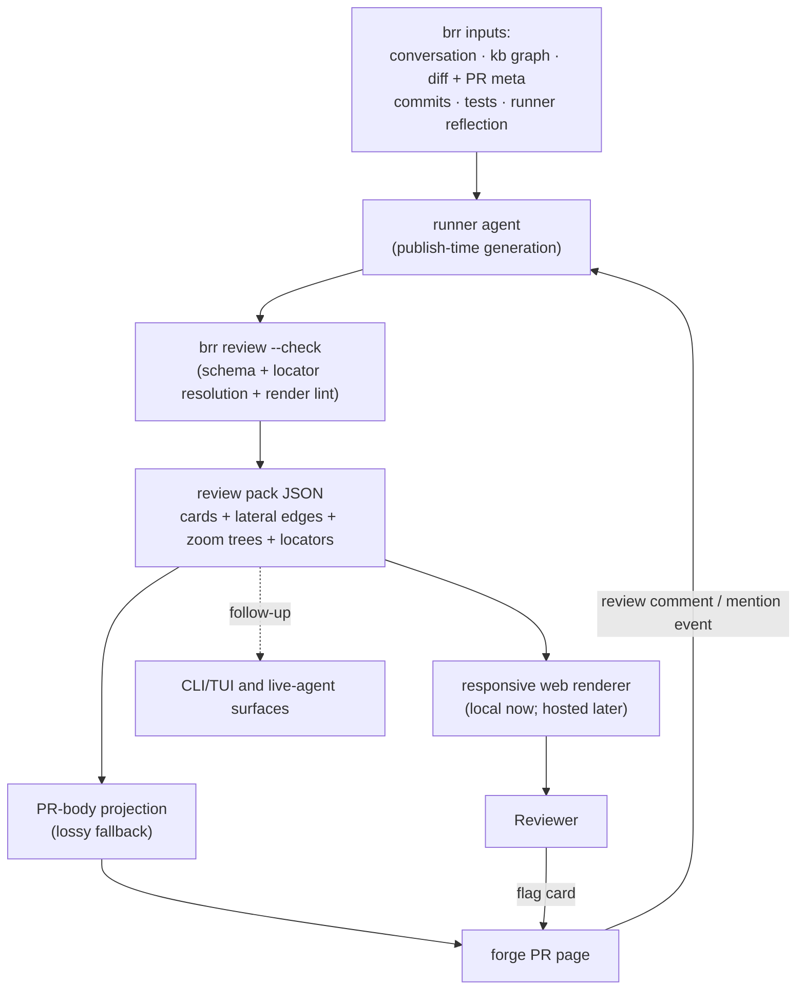

# Design: diffense — kb-first PR review experience

Status: accepted on 2026-05-29. The card / zoom / navigation model is
validated by a working renderer spike
([`src/brr/diffense/`](../src/brr/diffense)) against the
[PR #64 prototype pack](diffense-prototype-pr64.md). Implementation is
still partial: the repo currently contains the dependency-free renderer
spike only; pack generation, schema lock, `brr review` serving,
PR-body projection, transport, card flagging, and runner / publish wiring
remain future slices.

diffense (a working name: *diff* + *sense*, and *diff* + *defense*) is
brr's review surface for brr-generated PRs. It exists because generic
forge diffs are weak at the thing brr PRs need most: reading code,
tests, conversations, and kb changes as one system change rather than as
a linear hunk stream. Roughly half of a typical brr PR can be `kb/`, and
the kb is a graph of rendered Markdown, lifecycle markers, subject hubs,
decisions, and plans; unified diffs flatten that graph into text.

Companion pages:

- [`subject-kb.md`](subject-kb.md) — the kb shape diffense reads from.
- [`plan-kb-subcommand.md`](plan-kb-subcommand.md) — the `brr kb` read
  surface renderers compose with.
- [`design-publish-kernel.md`](design-publish-kernel.md) — the publish
  boundary where pack generation and PR-body projection attach.
- [`design-github-gate-vs-brnrd-app.md`](design-github-gate-vs-brnrd-app.md)
  — the review-comment gate boundary used by the feedback loop.
- [`plan-brnrd-dashboard-mvp.md`](plan-brnrd-dashboard-mvp.md) — the
  future hosted renderer home.
- [`design-agent-ergonomics.md`](design-agent-ergonomics.md) — the
  sibling back-channel for operator-facing agent-friction telemetry.

## Problem

The reviewer's real task is fitting a change into a mental model of the
system. A plain forge diff makes that harder for brr work:

- **Kb changes need rendered context.** Subject hubs, lifecycle markers,
  and cross-links are meaningful as a graph, not as raw Markdown hunks.
- **The delta is not enough.** Reviewers need to know which decision or
  plan a change implements, which conversation drove it, what tests
  ground it, and what the agent was uncertain about.
- **Tests encode user stories but are not written as explanations.** A
  test's `setup -> action -> assertion` arc is useful review evidence,
  but it needs a narrative wrapper.
- **Agent uncertainty is otherwise invisible.** The diff does not show
  assumptions, out-of-scope flags, trade-offs, or follow-up concerns.

The target audience is a reviewer who wants full context, whether solo
dogfooder or team peer. diffense is not optimized for rubber-stamp
skim-approval.

## Accepted Shape

diffense is a structured review pack rendered through one or more
surfaces. The pack is the contract; renderers are projections.

Implementation state matters:

- **Built now:** `src/brr/diffense/render.py` inlines a pack into
  `template.html` to produce a self-contained HTML file. The renderer is
  stdlib-only plus HTML/CSS/vanilla JS, and the checked-in
  `review-pr64.html` is generated from the prototype pack.
- **Designed, not built:** pack generation from runner state,
  `brr review --check`, the local server, PR-body projection, pack
  transport, reviewer flagging, hosted brnrd rendering, CLI/TUI, and
  live Q&A.

## Pack Contract

The pack is JSON. It is language-agnostic and durable enough to survive
renderer changes. A pack contains:

- **Metadata** for PR id, repository, base/head refs, head SHA,
  conversation id when available, generation time, and generator.
- **Cards** for reviewable units. Each card has identity, kind, gloss,
  optional stats/demo/test grounding, a zoom tree, lateral edges, and
  locators.
- **Reading order** so a renderer can lead with orientation, then
  concerns, then the highest-signal change cards.
- **Locators** into ground truth: code, diffs, kb pages, tests, commits,
  conversations, or forge URLs. A card without a resolvable locator is
  lying; the future `--check` command should fail it.

The pack should carry summaries and references, not copies of entire code
files. Ground-truth leaves are deterministic references to real artifacts.

## Card Model

The review surface is a zoomable graph of cards with two navigation axes:

- **Lateral:** typed edges to peer cards (`implements`, `calls`,
  `related`, `part-of-same-decision`, and similar).
- **Zoom:** a card descends from a one-line gloss through progressively
  richer summaries to a ground-truth leaf. Summaries are LLM-authored and
  clamp-gated; leaves are mechanical.

First-class card kinds:

- **Summary card:** one per pack, always first. It names the PR shape,
  braided arcs, surface area, and risk pointer. It is orientation, not a
  change card.
- **Item cards:** typed units of change such as `code-fn-new`,
  `code-fn-edit`, `code-module-split`, `code-move`, `kb-page-edit`,
  `lifecycle-flip`, `test-add`, or `dep-add`.
- **Walkthrough cards:** composite story cards. Their gloss is a
  `setup -> action -> outcome` user story; zooming reveals ordered member
  cards.
- **Uncertainty cards:** assumptions, concerns, dilemmas,
  out-of-scope flags, or follow-ups that arose during the run.

The kind set is an open core, not a closed enum. Renderers and `--check`
special-case the known kinds, while an agent may declare a `custom` kind
inline and raise a meta concern when no existing kind fits. Recurring
custom kinds should later graduate into the schema.

Every card carries enough structure to support honest review:

- **Identity:** stable id, human label, kind, optional symbol/path/line.
- **Locator:** the resolvable ground-truth target.
- **Lore:** what changed and what it enables.
- **Stats:** included only when they explain shape or risk.
- **Zoom tree:** gloss, one or more summaries, and a leaf.
- **Provenance:** commit and conversation pointers when available.
- **Edges:** typed links to peer cards or locators.

## Reading Order

The default reading order is:

1. **Summary:** orient the reviewer to the PR shape.
2. **Uncertainty:** surface risks and assumptions before persuasion.
3. **Change cards:** walkthroughs and item cards in the order that best
   explains the system change.

Uncertainty cards are gloss-first. The first human-readable line states
the worry in plain language; ids, locators, and tension references sit
below it. This keeps the surface honest without making the reviewer parse
metadata before the concern.

## Rendering Model

The accepted first renderer is responsive web, not TUI. A CLI/TUI can
arrive later over the same pack, but the first cut is web because phone
review and future hosted rendering matter more than keeping the initial
surface terminal-native.

The renderer spike settled two previously-open interaction details:

- **One breadcrumb stack for lateral and zoom-drill navigation.** Opening
  a peer edge or a walkthrough member pushes that card onto the same
  heading-bar stack. Within-card zoom (`gloss -> L1 -> leaf`) is in-place
  disclosure.
- **Code leaves jump to forge at v0.** A code card shows `path:line`
  inline and links to a commit-pinned forge URL. Inline diffs remain a
  renderer upgrade; they do not require a pack change.

The terminal aesthetic belongs to the web renderer, not to a literal
terminal. The spike uses monospace text, compact stat blocks, bordered
cards, and kind accents via CSS so the surface can reflow on a phone
without box-drawing overflow.

## Feedback Loop

diffense is a read surface wired into brr's existing review-event path:

1. The reviewer flags a card or asks for a change from the review
   surface.
2. The surface creates an anchored forge comment with card id, locator,
   and requested action.
3. The GitHub gate's `pr-review-comment` handling turns that comment into
   a task.
4. The agent responds in the same review thread and emits a new pack.

The OSS GitHub gate already handles the review-comment event boundary
documented in
[`design-github-gate-vs-brnrd-app.md`](design-github-gate-vs-brnrd-app.md).
The diffense-specific flagging UI and card-id payload are not built yet.

## Relationship To Ergo

diffense and the ergo proxy are siblings at the task boundary:

| | diffense | ergo proxy |
| --- | --- | --- |
| Audience | user / reviewer | operator |
| Subject | the result: change, grounding, uncertainty | the agent's ability to execute |
| Surface | review pack / cards | ergonomics record |

They can share the reflection-elicitation step and marker transport, but
they must stay split by audience. A shallow task can produce a diffense
uncertainty card for the reviewer and an ergo signal for the operator;
neither channel should absorb the other's noise.

## Project Boundary

The pack generation and validation tools belong in brr because they read
brr-specific inputs: conversations, kb graph, publish metadata, commits,
tests, and runner reflection. The web renderer also starts in brr at
[`src/brr/diffense/`](../src/brr/diffense). The renderer spike proves the
in-tree footprint is small: stdlib Python plus static assets, no runtime
dependencies, and no brnrd dependency.

brnrd later renders the same pack in the hosted dashboard. That hosted
view is a consumer, not a prerequisite. diffense should ship for
self-hosting before brnrd exists and stay light enough not to inherit
brnrd's deployment complexity.

## Validation Rules

The future `brr review --check` should be a blocking gate before publish.
It should at least verify:

- pack schema version and required fields;
- unique card ids and valid reading-order entries;
- lateral edges point to existing cards or typed locators;
- locators resolve to real files, lines, symbols, kb pages, commits, or
  forge URLs;
- every non-summary card has a ground-truth leaf;
- uncertainty cards have headline-first text and tension references when
  the concern comes from a trade-off;
- renderer smoke output is non-empty and does not rely on hosted assets.

## PR Body Projection

The PR body is a lossy fallback, not the design anchor. It should contain
the summary, concerns, narrative arc, touched surface, reading order, and
deferred/open work in human-readable Markdown. The full pack should travel
with the PR so `brr review <pr-url>` and hosted renderers can recover the
zoomable surface.

Transport is not locked. Candidate shapes are an HTML-comment marker
block in the PR body, a git note, or a `refs/diffense/*` ref with a size
threshold that decides when the body marker is too large.

## Discipline

Six clamps keep the surface from becoming another wall of generated prose:

- **Grounded:** every claim bottoms out in a real artifact.
- **Sharp:** a card has one job and a crisp gloss.
- **Honest:** concerns and assumptions are first-class.
- **Useful:** stats and demos earn their place by changing review
  judgment.
- **Non-prescriptive:** the surface explains the change; it does not
  bully the reviewer into approval.
- **Substrate-honest:** the terminal aesthetic serves readability and
  navigation; it does not cosplay a terminal where the web is the real
  substrate.

The "make review entertaining" ambition means removing accidental burden
and making exploration pleasant. It is not gamification.

## Open Implementation Decisions

- **Pack schema lock:** final discriminators, per-kind required fields,
  card ids, custom-kind promotion, locator shapes, and provenance fields.
- **Pack transport:** PR-body marker vs git note vs `refs/diffense/*`,
  including size threshold and privacy implications.
- **Pack versioning:** how successive review iterations on one PR are
  stored and diffed.
- **Card-level reviewer state:** local-only in `.brr/`, forge-backed, or
  both.
- **Aesthetic lock:** exact palette and typography after more real packs.
- **Inline code/diff rendering:** later upgrade over the same locator
  model.
- **Live Q&A over cards:** future surface using the pack as grounding
  context.
- **Name:** `diffense` is the working name; the command verb remains
  `brr review`.

## Rejected Shapes

- **Plain PR body only:** useful as fallback, but too lossy to carry the
  graph, locators, and feedback loop.
- **Text-first review document:** risks becoming another drifting
  document. The durable artifact is structured pack data.
- **Forge-hosted only:** the forge remains the PR system and data source;
  the review surface can be local, hosted, or terminal later.
- **Near-term Textual/TUI substrate:** dropped because mobile and hosted
  web are first-order requirements. CLI/TUI stays a follow-up over the
  same pack.
- **One closed enum for all change kinds:** too brittle for agentic
  review. Known kinds get schema support; unknown but useful kinds start
  as declared custom cards.

## Read Next

1. [`diffense-prototype-pr64.md`](diffense-prototype-pr64.md) — the first
   hand-authored pack and its schema findings.
2. [`diffense-prototype-pr64-pack.json`](diffense-prototype-pr64-pack.json)
   — the concrete pack rendered by the spike.
3. [`plan-kb-subcommand.md`](plan-kb-subcommand.md) — kb read surface for
   kb-page cards.
4. [`design-publish-kernel.md`](design-publish-kernel.md) — publish
   boundary where generation and projection wire in.
5. [`design-github-gate-vs-brnrd-app.md`](design-github-gate-vs-brnrd-app.md)
   — review-comment event handling for the feedback loop.

## Lineage

Lineage: drafted 2026-05-28 and accepted 2026-05-29 after two gates met:
the [PR #64 prototype pack](diffense-prototype-pr64.md) pressure-tested
the schema, and the [`src/brr/diffense/`](../src/brr/diffense) renderer
spike validated the read model, settled the single breadcrumb stack, and
made code leaves jump-to-forge for v0. Earlier text-only, TUI-first, and
closed-kind shapes were folded into the current pack-first web design;
the detailed pass history lives in git and `kb/log.md`.
