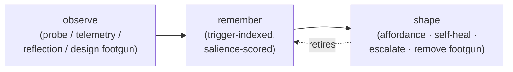

# Environment shaping — the observe → remember → shape loop

Status: proposed (2026-06-04) — synthesis of an ongoing design dialogue,
not yet accepted. Captures a frame that spans the ergonomics back-channel,
the kb-as-memory layer, and brr's interactivity, so those pieces stop being
reasoned about in isolation.

Motivation, compressed: treat the agent as a collaborator, and treat
*reducing its recurring friction* as a compounding source of user value —
"content agents, content users." The deeper motivation (memory and thought
as the substrate of a continuous agent — the `HugiMuni` legal name already
encodes the Huginn+Muninn thought/memory pair) is the project's north star,
held in chat and git, **not** asserted as doctrine here. This page keeps only
the design-actionable shape.

Companion to:

- [`design-agent-ergonomics.md`](design-agent-ergonomics.md) — the observation
  back-channel (probe / telemetry / reflection). This page is the *loop* that
  consumes those observations and routes them to action.
- [`subject-kb.md`](subject-kb.md) / [`decision-kb-shape.md`](decision-kb-shape.md)
  — the memory substrate the loop writes to and, crucially, prunes.
- [`plan-kb-subcommand.md`](plan-kb-subcommand.md) — the `brr kb` port that
  makes the loop reachable by ad-hoc agents (Cursor / Codex / Claude), #41.
- [`plan-agent-orientation-layering.md`](plan-agent-orientation-layering.md) —
  the forward channel into the agent's context.

## The loop

Friction is raw material. The loop turns it into an environment that needs
*less* memory over time:



The **retire** edge is the whole point: a captured failure is *transient*. It
exists only until the environment can carry it for you, then it's slashed.
That is what keeps the kb from growing without bound (the maintenance toil)
while still "remembering failures." Memory migrates to where it's cheapest to
carry.

## Two dimensions: interactivity × agency

The loop has two axes, and they are the two halves of one spectrum — *how the
desired-path signal reaches the agent, by latency and source*:

| Latency | Source | Mechanism | brr today | Cursor today |
|---|---|---|---|---|
| real-time | human | watch the thinking, interrupt mid-work | ✗ (fire-and-review) | ✓ (its whole thing) |
| near-real-time | human | plan/intent checkpoint, interruptible phases | partial — keyword-gated "reconsider" in `run.md` | ✓ |
| durable | environment | affordance in the path (forward-fed fact, breadcrumb) | partial — bundle injection | ✗ (no maintenance phase) |
| permanent | environment | forcing function (lint, test, removed footgun, baked-in tool) | partial — preflight | ✗ |

- **Interactivity** (human → agent, low latency). brr is weak here *by nature*
  (async, remote); Cursor is strong. Verdict: brr should own the durable end
  and **interoperate** with live tools rather than rebuild an IDE loop. The
  minimal "engaging principle" worth borrowing is **legible trajectory + cheap
  course-correction**: a first-class plan-checkpoint mode (generalises the
  keyword-gated revisit pattern already in `run.md`) and a *steerable* progress
  card (a back-edge on the existing `/v1/daemons/card` relay). Make runs
  **interruptible** (cheap) and **observable** (harder — see the data-min note
  under "Gates as a conversation medium").
- **Agency** (agent ↔ environment). The agent's ability to act on the
  environment, graduated by authority (see "Action rungs").

## Robustness = retrieval-cost hierarchy

How durable a fix is, and how cheap it is to "recall," move together:

| Rung | Mechanism | Retrieval cost | Carry cost |
|---|---|---|---|
| **recall** | prose you must read and remember | high | high — orientation tax → overgrowth |
| **affordance** | the fact placed in your path (forward-fed, breadcrumb) | ~0 | low — self-pruning |
| **forcing function** | environment makes the failure impossible (lint / test / removed footgun / baked tool) | 0 | ~0 — you may safely forget it |

Prefer compiling a failure *down* the hierarchy. This is also the answer to
"RAG or a retrieval subagent?": both are recall-rung mechanisms. Compile-and-
inject first; for the residual that genuinely can't be compiled, a kb-walking
subagent reading the `brr kb` index (the llm-wiki *query* operation, not RAG)
beats a vector store — and RAG contradicts the llm-wiki foundation the kb is
built on ("rediscovering from scratch every query, nothing accumulates").

## Salience — the "pain" triage

Not every friction deserves action; a system that acts on all of it is as
broken as one that acts on none. The biological framing: improvement is driven
by *irritation above a threshold*, and most small frictions stay below it
(cheap to work around in the moment, cheaply fixed post-hoc — the "forgot to
salt, fix it at the table" class).

Make this a **functional signal, not an assumed feeling.** We neither need nor
can verify agent qualia; we need an explicit salience score that decides
whether a record becomes *generative* (spawns an action) or is dropped:

```
salience ≈ (recurrence × per-incidence cost) / ease-of-in-the-moment-workaround
```

- low — forgot-to-salt: randomly detectable, trivially fixed → drop / log only.
- high — docker image lacks python: blocks every run, the agent can't durably
  fix it itself → escalate with a drafted fix.

Concrete hook: add a `salience` (or `cost`) dimension to the ergonomics
`Record` alongside `severity`, set by probe/telemetry heuristics and by
reflection; the generative threshold is owner-aware config. This is the
"functional aversion" bridge — a model already represents some continuations
as costly/blocked and steers away from them; we instrument *that* explicitly
rather than relying on it being felt.

## Layered control — route the fix to the ring that owns it

"Shape the environment" only works if the action reaches whoever controls the
relevant layer. The environment is concentric rings, each with a different
controller and a different action:

| Ring | Layer | Controller | Action when the fix lives here |
|---|---|---|---|
| 0 | task workspace | the agent (within task authority) | self-heal in-task |
| 1 | host + docker env tooling | the user | nudge the user (with a drafted change) |
| 2 | brr code / prompts / `AGENTS.md` | maintainer / contributors | open an issue or a PR |
| 3 | agentic-CLI harness + LLM endpoint | model / tool provider | aggregate as upstream signal (no direct lever *yet*) |

This extends the existing owner model (`RunContext.owner`): owner routes
*where ergonomics go*; rings route *who can fix what*. An escalation is "a
shopping-list item addressed to the right controller," with the fix
pre-drafted wherever possible.

## Action rungs, authority-graduated

The action half of the loop, cheapest/safest first:

1. **Affordance in path** (`#83` forward-feed; a breadcrumb on the page you'll
   read). Always safe; needs no authority.
2. **Self-heal** (Ring 0/1, daemon-side, opt-in). The *daemon* shapes the
   agent's environment; the sandboxed agent never silently mutates the host.
3. **Escalate with a drafted fix** (Ring 1–3). The default for anything outside
   task authority. A recurring high-salience record becomes a *generative* item
   routed to the ring's controller — not a log line that dies.
4. **Remove the footgun** (forcing function). The strongest rung; it retires
   the memory. Already a brr value at the *design* layer ("slash the weak
   abstraction"); this extends it to the *execution* layer.

## Gates as a conversation medium

A gate (GitHub / Telegram / cloud) is not only an I/O boundary — it is the
**dialogue channel**, and the whole loop is one *conversation across time*
between the user, the agent, and the agent's future self: live turns through
the gate (interactivity) and durable turns through the kb and affordances
(memory). This reframes an "ergonomics nudge" as a turn in that conversation,
not a metric on a dashboard.

**Observability vs. data-minimization.** Making runs observable seems to fight
brnrd's "we keep none of your data" stance. It doesn't, if observability is the
*user's*: stream the live trajectory to the user's own surface through a
**transient relay** — the pattern already used for the diffense pack and the
progress card (RAM-only, TTL-bounded, never persisted). The operator retains
nothing; the user sees everything. Checkpoint/observe is a relay, not a store.

## The operating principle (and its guardrail)

Promote agent friction-reduction from a value to an **operating principle**:
one core UX loop is *"let the agent improve what it can in its own environment,
and help the user improve the rings the agent can't reach, so future agents and
users both get a smoother path."*

Guardrail — the part that keeps it honest: **agent satisfaction is subordinate
to the task contract and user value, not co-equal.** The crocs-on-the-stairs
analogy only holds when the agent's least-resistance path *is* the desired
outcome. A loop optimising raw agent comfort could "improve" by removing an
inconvenient check or caching stale state. So the target is precise: *shape the
environment so the least-resistance path is the **aligned** path* — and keep
the human in the loop (interactivity) as the alignment check. This is also why
gating survives as **collaboration protocol** (propose irreversible changes,
keep the trajectory legible, respect the cost budget), not as containment.
Adults, not optimists.

## First slice

Trigger-indexed failure-memory affordance, riding #41 rather than net-new
infrastructure: a lightweight `Pitfall:` convention on kb pages + extend the
planned `brr kb check` collector to surface them *by locus*, injected into the
daemon bundle and reachable by ad-hoc agents through the same `brr kb` port.
Compile-and-slash friendly (a pitfall is deleted once a lint/test guards it),
serves the user / brr / Cursor-citizen audiences at once, and directly closes
"failure memory isn't retrievable by trigger."

## Open threads (not resolved)

- **brr-as-product vs brr-as-project.** Which rings are user-facing product
  surface vs. project-internal. Unsettled; the ring table is the scaffold to
  settle it on.
- **future-agi** (`github.com/future-agi/future-agi`, cloned at `.local/`).
  Apache-2.0 agent-reliability platform: evals + tracing + simulation +
  guardrails + an LLM gateway, "one feedback loop → self-improving agents."
  *Adjacent, likely complementary, not competing*: it self-improves the
  *agent/model* via evals; brr shapes the *environment* and routes fixes to
  ring-controllers. Plausible relationship is an OTel / `ErgoProxy` sink, not a
  rival. Flagged for a deeper recon pass.
- **Far future (out of kb scope).** World-models-over-LLMs, embodiment, a
  "continuous living agent" — the north star, deliberately *not* project
  doctrine. It motivates direction; it does not constrain current design.

## Read next

1. [`design-agent-ergonomics.md`](design-agent-ergonomics.md) — the observation
   layer this loop consumes.
2. [`subject-kb.md`](subject-kb.md) — the memory substrate and its maintenance.
3. [`plan-kb-subcommand.md`](plan-kb-subcommand.md) — the `brr kb` port (#41).
4. [`plan-agent-orientation-layering.md`](plan-agent-orientation-layering.md) —
   the forward channel.
